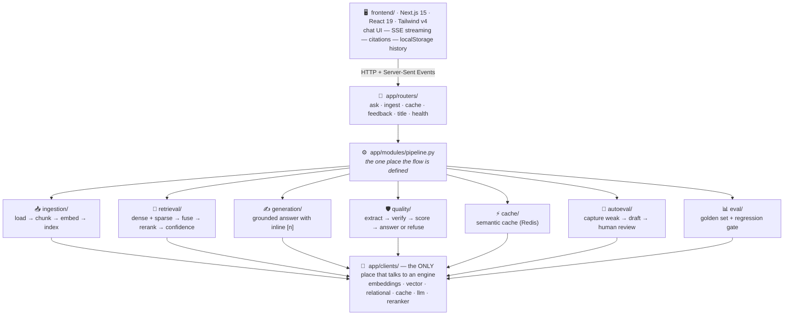
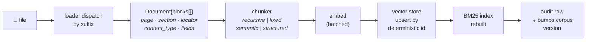
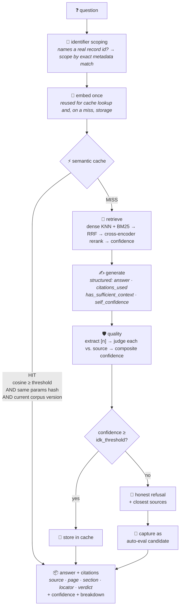

<div align="center">

# 🩺 Medical Research Assistant

### A production-grade RAG system that refuses to guess.

*Grounded answers over clinical literature — every citation verified against its source before it reaches the screen.*

<br>

[](https://www.python.org/)
[](https://fastapi.tiangolo.com/)
[](https://nextjs.org/)
[](https://react.dev/)
[](https://www.typescriptlang.org/)

[](https://github.com/pgvector/pgvector)
[](https://redis.io/)
[](https://www.trychroma.com/)
[](https://openai.com/)
[](https://www.docker.com/)

<br>


<br>

**[Quick Start](#-quick-start) · [Architecture](#-architecture) · [The Pipeline](#-the-two-lifecycles) · [What Broke & Why](#-the-bugs-worth-reading-about) · [Evaluation](#-evaluation) · [API](#-http-api)**

</div>

---

## 🎯 The Problem

Clinicians and researchers burn hours hunting through thousands of pages of literature for an evidence-based answer.

| Approach | Why it fails here |
|---|---|
| 🔍 **Keyword search** | Cannot match meaning — misses the relevant study that used different words |
| 🧠 **Vector search alone** | Misses exact terms: drug names, protocol codes, record identifiers |
| 💬 **Generic AI assistant** | Answers *fluently* but without citations or verification |

In healthcare, a confident but subtly wrong answer isn't a UX annoyance. **It's a patient-safety problem.**

## ✅ The Solution

Retrieval-Augmented Generation over **trusted documents only** — the user's own corpus, nothing else.

```
1. Retrieve the strongest evidence from the corpus
2. VERIFY every citation against its source chunk
3. Return a grounded answer + provenance + confidence score
4. REFUSE when the evidence doesn't support an answer
```

### Five non-negotiables that shaped every design decision

<table>
<tr><td width="34%">

**📌 Citations are verified, not decorative**

</td><td>

A judge model checks each inline `[n]` against the chunk it points at and labels it `supported` / `partial` / `unsupported`. An unverified citation is *worse* than none — it looks authoritative.

</td></tr>
<tr><td>

**🚫 Refusal is a feature**

</td><td>

Below the confidence threshold the system says *"I don't have enough information"*, lists the closest sources, and stops. Refusal accuracy is a **first-class metric** — currently **1.000**.

</td></tr>
<tr><td>

**📄 Provenance to page and section**

</td><td>

A clinician must be able to open the exact page of the exact guideline. Every chunk carries page / section / structural locator all the way into the UI.

</td></tr>
<tr><td>

**🔢 Facts by exact match, not similarity**

</td><td>

Embeddings cannot tell `PAT-20260042` from `PAT-20260043` — measured at **0.998 cosine similarity**. Identifiers get exact metadata matching.

</td></tr>
<tr><td>

**🔒 Zero outside knowledge**

</td><td>

Generation is constrained to retrieved context, so every answer is attributable to a document the user supplied.

</td></tr>
</table>

---

## 🚀 Quick Start

> **Prerequisites** — Python 3.13 (uv-managed venv), Node 20+, Docker *(optional)*, and an `OPENAI_API_KEY` in `.env`.

```bash
# 1️⃣  optional infrastructure — semantic cache + production stores
docker compose up -d              # redis :6380 · postgres/pgvector :5433

# 2️⃣  backend (terminal 1)
uv run uvicorn app.main:app --reload
#    if uv is blocked by machine policy:
#    .\.venv\Scripts\uvicorn.exe app.main:app --reload

# 3️⃣  frontend (terminal 2)
cd frontend && npm run dev
```

| | |
|---|---|
| 💬 **Chat UI** | http://localhost:3000 |
| 📘 **API docs** | http://localhost:8000/docs |

**Ingest documents** — drag files onto the chat composer 📎, or:

```bash
curl -X POST localhost:8000/v1/ingest \
     -H "Content-Type: application/json" \
     -d '{"source_dir": "data/corpus", "reset": true}'
```

<details>
<summary><b>🛠 Useful commands</b></summary>

```bash
uv run pytest -m "not slow"        # 93 fast tests — no models, no network
uv run pytest                      # everything, incl. model/API tests
uv run ruff check .                # lint
uv run python scripts/run_eval.py  # the regression gate
```
</details>

> 💡 **Runs with zero infrastructure.** SQLite + ChromaDB out of the box. Docker only when you want the semantic cache and production stores.

---

## 🏗 Architecture

A **modular monolith with clean seams** — so the planned service split is mechanical rather than a rewrite.



> ### ⚖️ The hard rule
> **Nothing outside `app/clients/` may import or touch a storage engine's own API.**
>
> That single rule is what turned the Postgres/pgvector migration into a *config change* instead of a rewrite — and it's what the service split depends on.

### 🤖 Models in use

| Role | Model | Where it runs |
|---|---|---|
| 🗣 Generation | `gpt-4o-mini` | OpenAI — final grounded answer |
| 🧭 Embeddings | `text-embedding-3-small` (1536-dim) | OpenAI |
| 🎯 Reranking | `cross-encoder/ms-marco-MiniLM-L-6-v2` | Local, CPU |
| ⚖️ Judge | `gpt-4o-mini` | Citation verification + eval grading |
| 🏷 Titling | `gpt-4o-mini` | ~30 tokens per new chat |

---

## 🔄 The Two Lifecycles

### 📥 INGEST — `POST /v1/ingest` · `POST /v1/ingest/upload`



> **🔑 Key property — idempotent re-ingest.** Deterministic chunk ids + delete-before-add mean re-uploading a document *replaces* its chunks. No duplicates, no orphans.

### 💬 ASK — `POST /v1/ask` · `POST /v1/ask/stream`



### 🧮 The composite confidence score

```
composite = 0.40 × retrieval confidence
          + 0.40 × citation accuracy  (judge verdicts)
          + 0.20 × model self-confidence
```

**Why blend three signals?** On an out-of-corpus question the model self-rated **0.9** while retrieval and citation accuracy were both **0.0**. Any single signal can be fooled. The blend caught it and refused.

---

## 🧱 Build History

<table>
<tr><th>Phase</th><th>What shipped</th><th></th></tr>

<tr><td><b>0</b><br>Scaffold</td><td>Modular-monolith layout, typed config, structured logging, health/ready endpoints, smoke tests.</td><td>✅</td></tr>

<tr><td><b>1</b><br>Thin slice</td><td>Markdown loader → header-aware chunker → local embeddings → ChromaDB → grounded generation with inline <code>[n]</code>. File upload + idempotent re-ingest.</td><td>✅</td></tr>

<tr><td><b>2</b><br>Hybrid retrieval</td><td>Dense + BM25 fused with <b>Reciprocal Rank Fusion</b>, reranked by a local cross-encoder, scored into one confidence. Three chunking strategies, config-selectable so they can be benchmarked.<br><i>Why: keyword search misses paraphrases; vector search misses drug names and IDs. Fusion gets both.</i></td><td>✅</td></tr>

<tr><td><b>3</b><br>⭐ Quality layer</td><td><b>The heart of the system.</b> generate → extract <code>[n]</code> → judge each citation → composite confidence → <b>IDK gate</b> at 0.45. Below it, the answer is replaced with an honest refusal that still lists the closest sources.</td><td>✅</td></tr>

<tr><td><b>4</b><br>Eval harness</td><td>20 human-authored cases (simple / multi-hop / ambiguous / no-answer) over a 154-document corpus. Deterministic metrics + judge-graded metrics against the <b>human</b> reference, so grading isn't circular.<br><b>Proven:</b> the gate caught a deliberate model downgrade — 0.969 → 0.918.</td><td>✅</td></tr>

<tr><td><b>5</b><br>Semantic cache</td><td>Redis Stack with RediSearch vector KNN. A hit needs <b>three</b> things at once: cosine ≥ threshold, identical params hash, current corpus version.<br><b>Measured:</b> cold 26s → exact repeat <b>190ms</b> → paraphrase hit → post-ingest miss. Redis down? The pipeline just runs.</td><td>✅</td></tr>

<tr><td><b>6</b><br>Auto-eval loop</td><td>Weak answers (low confidence, refusals, 👎) are captured to a queue. A separate step drafts a reference answer <b>twice</b> and auto-approves only when both runs agree. A human always approves before anything reaches the eval set — and approved drafts land in a <b>separate file</b> so the hand-written golden set stays trustworthy.</td><td>✅</td></tr>

<tr><td><b>7</b><br>9-format ingestion</td><td>Block-based IR: every chunk descends from exactly one <code>Block</code> and inherits its page, section, locator and content type — <b>provenance survives every chunking strategy</b>. OCR runs only on images and scanned PDF pages (detected by text density); OCR failure never breaks an ingest.</td><td>✅</td></tr>

<tr><td><b>8</b><br>Frontend + API polish</td><td>ChatGPT-style UI with real token-by-token SSE streaming, citations with page/section, conversation history, thumbs feedback wired into the auto-eval loop, strictly black-and-white theme. Backend: <code>/v1/ask/stream</code>, CORS, <code>/v1/documents</code>, <code>/v1/system</code>, <code>/v1/title</code>.</td><td>✅</td></tr>

<tr><td><b>9A</b><br>Postgres / pgvector</td><td>Storage engines became pluggable — <code>stores.vector: chroma | pgvector</code>, <code>stores.relational: sqlite | postgres</code>. A <code>VectorStore</code> protocol sits in front of both; Chroma's API no longer leaks anywhere. pgvector uses one table (vector + jsonb), HNSW index, GIN on metadata. Migration copies vectors <b>without re-embedding</b>.<br><b>Gated:</b> eval re-run at 0.927 — no regression.</td><td>✅</td></tr>

<tr><td><b>9B</b><br>Service split</td><td>Planned split into <b>ingestion</b> (pymupdf, easyocr) · <b>retrieval</b> (torch) · <b>api</b>. The seams already exist; the work is Dockerfiles, HTTP clients mirroring today's function signatures, and compose wiring.<br><b>The win:</b> the API container stops carrying ~2 GB of torch.</td><td>🚧</td></tr>
</table>

---

## 🔬 The Bugs Worth Reading About

> *Every one of these was **reproduced and quantified** before it was fixed. Several turned out to have a different cause than the symptom suggested.*

<details open>
<summary><b>🐛 8.1 — Structured records were <i>always</i> refused</b></summary>

The cross-encoder reranker is trained on prose. Measured scores on a **perfectly relevant** chunk:

| Chunk type | Reranker score |
|---|---|
| CSV row | **−7.18** |
| PDF prose | −0.09 |

`sigmoid(−8) ≈ 0.0003`, which the quality gate reads as *"no evidence"*. Result: **every** question about a CSV/JSON/XML file was refused, regardless of the data.

**Fix** → confidence for record-type chunks comes from the dense cosine instead. Ranking still uses the reranker.
</details>

<details>
<summary><b>🐛 8.2 — Grounded answers were being thrown away</b></summary>

Summary-style answers declare their sources in the structured field but write no inline `[n]` in the prose. Citation accuracy scored **0**, the composite fell under the gate, and a *correct* answer was replaced by a refusal — while the response still listed 5 sources underneath it.

**Fix** → when no inline markers exist, verify the declared sources instead.
**Measured on a real CSV question:** `0.18` (refused) → **`0.727`** (answered).
</details>

<details>
<summary><b>🐛 8.3 — Different patient IDs returned the same answer</b></summary>

Measured query similarity with `text-embedding-3-small`:

| Pair | Cosine |
|---|---|
| `PAT-20260004` vs `PAT-20260042` | **0.9982** |
| `PAT-20260042` vs `PAT-20260043` | **0.9987** |

Both far above the 0.90 cache threshold — so the cache served the *first* patient's answer for every subsequent one. Nearest-neighbour search can't separate them either.

**Fix** → identifier-aware exact lookup, resolved **before** the cache key is built, so two ids can never share a cache entry.
</details>

<details>
<summary><b>🐛 8.4 — A 10k-line JSON export answered nothing useful</b></summary>

Splitting only at the top level left `{"patients":[...]}` as one **54 KB block**, which token-slicing then cut mid-record: 120 patients became 39 chunks, none holding a whole record, all carrying the same locator.

**Fix** → structure-aware descent: **120 blocks, 120 distinct locators, one record per chunk**, each carrying its scalar fields as searchable metadata.
</details>

<details>
<summary><b>🐛 8.5 — Uploaded CSVs were unreadable to the embedder</b></summary>

Spreadsheet exports merge header cells and Excel writes a BOM, so chunks read:

```
Id | Identifier: MRN | : http://... | : true
```

**Fix** → blank columns inherit their group with a positional suffix (`Identifier 2`), empty cells are skipped, files decoded as `utf-8-sig`.
</details>

<details>
<summary><b>🐛 8.6 — "Cannot reach the API" that was not a network problem</b></summary>

An unhandled exception in FastAPI is handled **outside** the CORS middleware — so the 500 carried no `Access-Control-Allow-Origin` header, the browser refused to read it, and the client reported the API as unreachable. The real cause was an embedding-dimension mismatch.

**Fix** → return `409` with an actionable message through the normal response path.
</details>

<details>
<summary><b>🐛 8.7 — Embedding model scale changes what a threshold <i>means</i></b></summary>

| | `bge-base` (local) | `text-embedding-3-small` |
|---|---|---|
| Paraphrase | 0.89 – 0.94 | **0.61 – 0.84** |
| Unrelated | ~0.47 | **~0.006** |

A cache threshold of `0.90` was correct for bge and is **nearly dead** for OpenAI. Measured recommendation: **`0.80`** (5/9 correct hits, 0/8 wrong answers).

⚠️ **The classes overlap** — a genuine paraphrase can score 0.59 while two genuinely different questions score 0.75. No threshold is perfect. **Err high:** a cache miss costs a second; a wrong hit serves a confident, fully-cited answer to a question nobody asked.
</details>

---

## 📊 Evaluation

```bash
uv run python scripts/run_eval.py              # single run
uv run python scripts/run_eval.py --benchmark  # compare all 3 chunkers
```

**Latest run** — recursive chunker, 20 cases, `text-embedding-3-small`:

<div align="center">

| Metric | Score | |
|---|---|---|
| **Overall** | **0.927** | 🟢 |
| Refusal accuracy (`idk`) | **1.000** | 🟢 |
| Faithfulness | 0.990 | 🟢 |
| Correctness | 0.970 | 🟢 |
| Completeness | 0.940 | 🟢 |
| Retrieval recall | 0.925 | 🟢 |
| Citation accuracy | 0.713 | 🟡 |

| By question type | Score |
|---|---|
| `no_answer` | **1.000** 🟢 |
| `simple` | 0.959 🟢 |
| `multi_hop` | 0.872 🟢 |
| `ambiguous` | 0.780 🟡 |

</div>

### 📖 Reading these honestly

- **`idk_accuracy 1.000`** — the system refused every question it *should* have refused. For this domain, that is the single most important number on the page.
- **`faithfulness 0.990`** — answers stayed inside their sources.
- **`citation_accuracy 0.713`** — the weakest metric and the obvious next target. It counts partial credit for citations the judge rates `partial`.
- **`ambiguous 0.780`** — expected. Those cases are *deliberately* under-specified.

---

## 🔌 HTTP API

<details open>
<summary><b>💬 Ask</b></summary>

| Method | Endpoint | Description |
|---|---|---|
| `POST` | `/v1/ask` | Grounded answer (JSON) |
| `POST` | `/v1/ask/stream` | Same pipeline as SSE: `meta → delta* → final` |
| `POST` | `/v1/title` | Name a chat from its first question |

> ⚠️ **The `final` frame is authoritative.** It carries the verified citations, the confidence, and any gate replacement. The streamed draft is not the answer.

**Request options that matter**

| Field | Effect |
|---|---|
| `filters.source` | One filename or a list — this is how an attached file scopes a question |
| `filters.file_type` | `pdf` · `docx` · `csv` · `json` · … |
| `mode` | `hybrid` · `dense` — per-request override |
</details>

<details>
<summary><b>📥 Ingest & documents</b></summary>

| Method | Endpoint | Description |
|---|---|---|
| `POST` | `/v1/ingest` | Ingest a directory — `{source_dir, reset}` |
| `POST` | `/v1/ingest/upload` | Multipart upload (the UI path) |
| `GET` | `/v1/documents` | What's searchable, with chunk counts |
| `DELETE` | `/v1/documents/{source}` | Remove a doc, rebuild BM25, invalidate the cache |
| `GET` | `/v1/system` | Model wiring + corpus size |
</details>

<details>
<summary><b>⚡ Cache · 👍 Feedback · 🔁 Auto-eval · ❤️ Health</b></summary>

| Method | Endpoint | Description |
|---|---|---|
| `GET` | `/v1/cache/stats` | Hits, misses, hit rate |
| `POST` | `/v1/cache/flush` | Drop cached answers |
| `POST` | `/v1/feedback` | `up` · `down` · `retracted` |
| `GET` | `/v1/eval/candidates` | The auto-eval review queue |
| `POST` | `/v1/eval/candidates/process` | Draft reference answers |
| `POST` | `/v1/eval/candidates/{id}/approve` \| `/reject` | Human gate |
| `GET` | `/health` | Liveness |
| `GET` | `/ready` | Dependency checks (vectors, sqlite) |
</details>

---

## 🖥 Frontend

**Next.js 15 (App Router) · React 19 · TypeScript strict · Tailwind v4** — ~3,100 lines.

Strictly **black and white**: status is conveyed by icon and contrast level, never by hue — which is also the accessible pattern.

- ⚡ Answers stream token by token; the terminal frame replaces the streamed draft with the **verified** answer, and says so when the quality gate swapped in a refusal.
- 📎 Attaching a file **scopes** the question to it. The composer footer states the scope — *"Answering from DIABETES.pdf"* — so the narrowing is never invisible.
- 🗂 Attachments render as cards above the question. The paperclip opens the file picker directly and ingestion starts on selection — **no confirm step**.
- 🏷 Conversations are named by a model from the first question — *"How do I install FastAPI on Windows?"* → **"FastAPI Setup on Windows"** — created lazily, stored in `localStorage` because the backend is stateless.
- 📚 Sources are collapsible and show filename, page, and the judge's verdict.
- 👍👎 Thumbs toggle; retracting a thumbs-down **withdraws** the auto-eval candidate it created.

---

## 🗂 Repository Map

<details>
<summary><b>Expand the full tree</b></summary>

```
app/
├── main.py                 FastAPI app factory, CORS, lifespan, router wiring
├── config.py               ALL typed settings — .env (secrets) + config/system.yaml
│                           (behaviour). No magic numbers in code.
├── logging_config.py       structured JSON logging
│
├── clients/                ⚠️ the only code that knows about engines
│   ├── llm.py              OpenAI + instructor (structured output) + judge
│   ├── embeddings.py       OpenAIEmbedder | LocalEmbedder — same interface
│   ├── reranker.py         local cross-encoder
│   ├── vectorstore.py      facade: get_vector_store() by config
│   ├── vector/base.py      VectorStore protocol, VectorHit, dimension guard
│   ├── vector/chroma.py    ChromaDB backend (zero infrastructure)
│   ├── vector/pgvector.py  Postgres + pgvector backend (production)
│   ├── relational.py       sqlite | postgres dialect adapter
│   ├── db.py               audit / eval / candidate / feedback queries
│   └── cache.py            Redis Stack (RediSearch KNN) semantic cache
│
├── models/schemas.py       every request/response contract (Pydantic)
│
├── modules/
│   ├── pipeline.py         ask() and ask_stream() — the orchestrator
│   ├── ingestion/
│   │   ├── loader.py       directory walk + format allowlist
│   │   ├── loaders/base.py Block / Document IR, @register decorator
│   │   ├── loaders/*.py    md · txt · html · pdf · docx · image · csv · json · xml
│   │   ├── ocr.py          engine-agnostic OCR (easyocr | tesseract)
│   │   ├── chunker.py      recursive | fixed | semantic | structured
│   │   ├── indexer.py      embed + write metadata + dimension guard
│   │   └── service.py      orchestration, document listing, deletion
│   ├── retrieval/
│   │   ├── dense.py        vector KNN
│   │   ├── sparse.py       BM25 (rebuilt from the store, pickled)
│   │   ├── fusion.py       Reciprocal Rank Fusion
│   │   ├── hybrid.py       the full dense + sparse + rerank flow
│   │   ├── confidence.py   score → 0..1, content-type aware
│   │   ├── filters.py      metadata filters → engine-specific queries
│   │   ├── identifiers.py  exact record lookup for id questions
│   │   └── retriever.py    mode dispatch (hybrid | dense)
│   ├── generation/
│   │   ├── prompt.py       system prompts + context rendering
│   │   ├── generator.py    answer, streamed answer, chat title
│   │   └── schemas.py      GeneratedAnswer / GeneratedTitle contracts
│   ├── quality/
│   │   ├── extractor.py    pull [n] markers, pair them with claims
│   │   ├── verifier.py     batched LLM judge → per-citation verdict
│   │   ├── confidence.py   composite score maths
│   │   └── service.py      assess() → report + answerable decision
│   ├── cache/service.py    lookup / store / params hash
│   ├── autoeval/           capture → draft → human approve
│   └── eval/               golden set, metrics, runner, report
│
├── routers/                ask · ingest · cache · feedback · title · health
└── utils/tokens.py         token counting and splitting (tiktoken)

frontend/
├── app/                    Next.js App Router entry, global CSS (theme tokens)
├── components/             app-shell · chat-view · composer · message · sources
│                           sidebar · history-view · document-chips · markdown · ui/
├── hooks/                  use-chat (conversations + SSE) · use-documents · use-theme
└── lib/                    api client · types mirroring backend schemas
                            localStorage persistence · formatting helpers

config/system.yaml          the behaviour of the whole system
scripts/                    fetch_corpus · run_eval · cache_loadtest · migrate_to_postgres
eval/golden_set.jsonl       20 human-written evaluation cases
tests/                      93 fast + 15 slow
docker-compose.yml          redis-stack (6380) · pgvector/pg17 (5433)
```
</details>

---

## ⚙️ Configuration

Everything that changes behaviour lives in **`config/system.yaml`**. Secrets live in `.env` (`OPENAI_API_KEY`, optionally `POSTGRES_DSN`) and are never committed.

<details>
<summary><b>Expand the knobs</b></summary>

| Group | Keys |
|---|---|
| `models.*` | `embedding` (provider, name, dimensions, batch_size) · `generation` · `judge` · `title` |
| `stores.*` | `vector: chroma\|pgvector` · `relational: sqlite\|postgres` · `postgres` (dsn, table, HNSW params, pool sizes) |
| `retrieval.*` | `mode` · `default_top_k` · `dense/sparse/rerank_candidates` · `rrf_k` · `dense_weight` · `sparse_weight` · `structured_confidence_from_dense` *(→ 8.1)* · `identifier_match_confidence` *(→ 8.3)* |
| `ingestion.formats.*` | `enabled` · `pdf.scanned_text_density_threshold` · `ocr` (engine, languages, dpi) · `csv.rows_per_chunk` · `json` (max_record_tokens, max_depth, extract_fields, id_keys) · `chunking` |
| `quality.*` | `verify_citations` · `idk_threshold` · `confidence_weights` |
| `cache.*` | `enabled` · `redis_url` · `threshold` · `ttl_seconds` |
| `autoeval.*` | `flag_confidence_threshold` · `dedup_threshold` · `agreement_threshold` |
| `eval.*` | `golden_path` · `retrieval_k` · `regression_tolerance` |
</details>

---

## 💾 Data Stores

| Store | Engine | Notes |
|---|---|---|
| 🧭 **Vectors** | ChromaDB *(default, on disk)* or Postgres + pgvector | HNSW index, GIN on metadata |
| 🔤 **Keyword index** | BM25 | Rebuilt from the vector store after every ingest, pickled to disk |
| 🗃 **Operational** | SQLite *(default)* or Postgres | `ingestion_audit` *(max id = corpus version)* · `eval_runs` / `eval_case_results` · `eval_candidates` · `feedback` *(append-only; a retraction is a new row)* |
| ⚡ **Cache** | Redis Stack | HNSW COSINE index; entries tagged with params hash + corpus version |

<details>
<summary><b>🐘 Switching to Postgres</b></summary>

```bash
uv add "psycopg[binary,pool]"
python scripts/migrate_to_postgres.py --dry-run
python scripts/migrate_to_postgres.py
# then set:  stores.vector: pgvector   ·   stores.relational: postgres
```

> ℹ️ `psycopg` isn't currently installed (uv blocked by machine policy), so the Postgres code paths are written and **SQL-verified against a live container** but haven't been run from Python. They fail with an actionable message if the driver is missing.
</details>

---

## 🧭 Design Principles

> **1. Config over constants.** Every threshold, model name and strategy lives in `config/system.yaml`. There are no magic numbers in the code.
>
> **2. Measure before fixing.** Every bug above was reproduced and quantified first — several had a different cause than the symptom suggested.
>
> **3. Refusing is allowed.** The system is designed to say *"I don't know"* and is graded on how well it does so.
>
> **4. Degrade, never crash.** Redis down, OCR missing, a title model failing, a malformed JSON file — each is logged and stepped around. Ingest and ask keep working.
>
> **5. Fail loudly where silence is dangerous.** An unsupported metadata filter *raises* instead of being dropped, because a silently ignored filter widens a scoped search without telling anyone.
>
> **6. One seam per engine.** Everything engine-specific lives in `app/clients/`.
>
> **7. Every phase ships with tests** — and, from Phase 4 on, must pass the evaluation gate before the next phase starts.

---

## 🚧 Known Limitations & Open Work

### Domain leftovers
*The product targets medicine; these still carry the original generic-RAG domain and should be retired.*

- [ ] `prompt.SYSTEM_PROMPT` still says *"technical documentation assistant for FastAPI"* — every medical answer is currently produced under that persona
- [ ] `eval/golden_set.jsonl` is 20 FastAPI questions, so the regression gate measures a domain the product no longer targets
- [ ] `scripts/fetch_corpus.py` fetches FastAPI documentation
- [ ] The auto-eval draft prompt refers to a *"FastAPI docs assistant"*

### Engineering
- [ ] **Phase 9B** (service split) not started
- [ ] `cache.threshold` is still `0.90` — near-dead for the current embedding model; `0.80` is the measured recommendation *(→ 8.7)*
- [ ] `autoeval.dedup_threshold` and `agreement_threshold` were calibrated for the old embedding model and need the same treatment
- [ ] `psycopg` not installed, so Postgres paths are unrun from Python
- [ ] `.jsonl` isn't a registered format, despite being a natural fit for the record-per-line model
- [ ] Only the top level of a deeply nested JSON object is exploded; a single very deep object still becomes one large block (then token-capped)
- [ ] `frontend/components/upload-dialog.tsx` is no longer rendered (the composer replaced it) but is still in the tree

<details>
<summary><b>🪟 Environment notes (Windows)</b></summary>

- `uv.exe` is intermittently blocked by an Application Control policy. The venv binaries work directly: `.\.venv\Scripts\uvicorn.exe`, `.\.venv\Scripts\python.exe -m pytest`
- The same policy blocks a DLL inside `easyocr`, so the slow real-OCR test fails on this machine. The fast suite fakes OCR and is unaffected.
- **Never run two `npm run dev` servers** — they share `.next` and corrupt each other's CSS chunks, producing a completely unstyled page.
- Redis is mapped to host `6380` and Postgres to `5433` because `6379`/`5432` are commonly taken.
</details>

---

<div align="center">

### 📈 By the numbers

| | | | |
|---|---|---|---|
| **~5,500** lines of Python | **~3,100** lines of TypeScript | **~1,500** lines of tests | **157** commits |
| **17** HTTP endpoints | **9** ingestion formats | **154**-document eval corpus | **20** golden cases |

<br>

**Built by [Hareesh Kumar K](https://github.com/HareeshDaxton)**

*Learn deeply. Build relentlessly. Improve continuously.*

<br>

⭐ **[Star this repo](https://github.com/HareeshDaxton/Production-RAG)** if a RAG system that knows when to shut up sounds useful to you.

</div>
